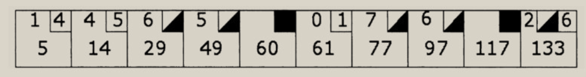

### 保龄球赛积分程序

#### 保龄球规则概述

&emsp;&emsp;保龄球是一种比赛，比赛者把一个哈蜜瓜大小的球顺着一条窄窄的球道投向10个木瓶。目的是在每次投球中击倒尽可能多的木瓶。

&emsp;&emsp;一局比赛由10轮组成。每轮开始，10个木瓶都是竖立摆放的。比赛者可以投球两次，尝试击倒所有木瓶。

比赛情况：

1. 如果比赛者在第一次投球中就击倒了所有木瓶，称之为“全中”，并且本轮结束。

2. 如果比赛者在第一次投球中没有击倒所有木瓶，但在第二次投球中成功击倒了所有剩余的木瓶，称之为“补中”。一轮中第二次投球后，即使还有未被击倒的木瓶，本轮也宣告结束。

得分情况：

1. 全中轮的记分规则为：10，加上接下来的两次投球击倒的木瓶数，再加上前一轮的得分。

2. 补中轮的记分规则为：10，加上接下来的一次投球击倒的木瓶数，再加上前一轮的得分。

3. 其他轮的记分规则为：本轮中两次投球所击倒的木瓶数，加上前一轮的得分。

   ps:如果第10轮为全中，那么比赛者可以再多投球两次，以完成对全中的记分。同样，如果第10轮为补中，那么比赛者可以再多投球一次，以完成对补中的记分。因此，第10轮可以包含3次投球而不是2次。



&emsp;&emsp;上面的记分卡展示了一场虽然不太精彩，但具有代表性的比赛的得分情况。

1. 第1轮，比赛者第一次投球击倒了1个木瓶，第二次投球又击倒了4个。于是第一轮的得分是5。
2. 第2轮，比赛者第一次投球击倒了4个木瓶，第二次投球又击倒了5个。本轮中共击倒了9个木瓶，再加上前一轮的得分，本轮的得分是14。
3. 第3轮，比赛者第一次投球击倒了6个木瓶，第二次投球击倒了剩余的所有木瓶，因而是一个补中。只有到下一次投球后才能计算本轮的得分。
4. 第4轮，比赛者第一次投球击倒了5个木瓶。此时可以完成第3轮的记分。第3轮的得分为10，加上第2轮的得分（14），再加上第4轮中第一次投球击倒的木瓶数（5），结果是29。第4轮的最后一次投球为补中。
5. 第5轮为全中。此时计算第4轮的得分为：29+10+10 = 49。
6. 第6轮的成绩很不理想。第一个球滚入了球道旁的槽中，没有击倒任何木瓶。第二个球仅击倒了一个木瓶。第5轮中全中的得分为：49+10+0+1 = 60。
7. 其余轮次得分可以自行计算。

#### 实践过程

角色：Bob Koss (RSK)、Bob Martin (Bob Martin) 

RCM：我想编写一个应用程序来记录一届保龄球联赛。需要记录下所有的比赛，确定团队的等级，确定每次周赛的优胜者和失败者，并且准确地记录每场比赛的成绩。

RSK：你已经列出了一些**用户故事**，想先做哪一个呢？

RCM：先来实现记录一场比赛成绩的功能吧。

RSK：好。它指的是什么呢？该故事的输入和输出是什么呢？

RCM：在我看来，输入只是一个投球（throw）的序列。一次投球仅仅是一个整数，表明了此次投球所击倒的木瓶数目。输出就是每一轮（frame）的得分。

RSK：如果你在这个练习中**扮演客户的角色**，会希望什么形式的输入和输出呢？

RCM：好，我扮演客户。我们需要一个函数，调用它可以添加投球，还需要另外的函数用来获取得分。有点像下面的样子：

```java
ThrowBall(6);
ThrowBall(3);
Assert.AreEqual(9, GetScore());
```

RSK：好，我们需要一些测试数据。我来画一张记分卡的小草图。


RCM：这名选手发挥得很不稳定。

RSK：或许喝醉了，但是可以作为一个相当好的**验收测试用例**。

RCM：我们还需要其他的验收测试用例，稍后再考虑吧。该如何开始呢？要做一个系统设计吗？

RSK：我不介意用**UML图**来说明从记分卡中得到的一些**问题领域概念**。从中会发现一些候选对象，可以在随后编码时使用。

RCM：好，显然，Game对象由一系列共10个Frame对象组成，每个Frame对象可以包含1个、2个或者3个Throw对象。

RSK：好主意。这也正是我所想的。我立刻把它画出来：


RSK：好，来选取一个要测试的类。从依赖关系链的尾部开始，依次往后如何？这样会容易测试一些。

RCM：当然可以。我们来创建Throw类的测试用例。

RSK：

```java
import org.junit.jupiter.api.Test;

public class ThrowTest {

    @Test
    public void testXXX() {
        
    }

}
```

RSK：Throw对象应该具有什么行为呢？

RCM：它保存着比赛者所击倒的木瓶数。

RSK：好，你只用了寥寥数语，可见它确实没做什么事情。也许我们应该重新审视一下，来**关注具有实际行为的对象，而不是仅仅存储数据的对象**。

RCM：嗯，你的意思是说实际上Throw这个类也许不必存在？

RSK：是的，如果它不具有任何行为，能有多重要呢？我还不知道它是否应该存在。我只是觉得如果我们去关注那些不仅仅只有设置方法和获取方法的对象的话，会更有效率。

RCM：好吧，我们上移至依赖链上的Frame类，看看是否能在编写该类的测试用例时，完成Throw类。

RSK：好，新的文件，新的测试用例。

```java
import org.junit.jupiter.api.Test;

public class FrameTest {
    
    @Test
    public void testXXX() {
        
    }
    
}
```

RCM：嗯，这是第二次键入这样的代码了。现在，你想到一些针对Frame类的有趣的测试用例吗？

RSK：Frame类可以给出它的分数，每次投球击倒的木瓶数，以及是否为全中或者补中……

RCM：好，用代码来说明问题。

```java
// FrameTest.java
import org.junit.jupiter.api.Test;
import static org.assertj.core.api.Assertions.assertThat;

public class FrameTest {

    @Test
    public void testScoreNoThrows() {
        Frame frame = new Frame();
        assertThat(frame.getScore()).isEqualTo(0);
    }

}

// Frame.java
public class Frame {

    public int getScore() {
        return 0;
    }

}
```

RCM：好，测试用例通过了，但是score实际上是一个愚蠢的属性。如果向Frame中加入一次投球的话，它就会失败。所以我们来编写这样的测试用例，它会加入一些投球，然后检查得分。

```java
// FrameTest.java
@Test
public void testAddOneThrow() {
  Frame frame = new Frame();
  frame.add(5);
  assertThat(frame.getScore()).isEqualTo(5);
}
```

RCM：这不能编译通过。Frame类中没有Add方法。

RSK：我打赌如果你定义这个方法，就会编译通过 ;-)

RCM：

```java
// Frame.java
public void add(Throw t) {
        
} 
```

RCM：这不可能编译通过的，因为还没有编写Throw类。

RSK：和我说说，Bob。在测试中传给Add方法的是一个整数，而该方法期望一个Throw对象。**add方法不能具有两种形式**。在我们再次关注Throw类前，你能描绘一下Throw类的行为吗？

RCM：哦，我甚至都没有注意到我写的是`f.add(5)`。我应该写`f.add(new Throw(5))`，但那太不优雅了。我真正想写的就是`f.add(5)`。

RSK：**先不管是否优雅，我们暂时把美学的考虑放到一边**。你能描绘一下Throw对象的行为吗？是二进制表示吗，Bob？

RCM：101101011010100101。我不知道Throw是否具有一些行为。我现在觉得Throw就是int。不过，我们不必再考虑它了，因为我们可以让`Frame.add`接受一个int。

RSK：**那么我觉得这样做的根本原因就是简单。当出现问题时，可以使用一些更复杂的方法。**

RCM：同意。

```java
// Frame.java
public void add(int pins) {

}
```

RCM：好，编译通过而测试失败了。现在，我们来让测试通过。

```java
// Frame.java
public class Frame {

    private int score;

    public int getScore() {
        return score;
    }

    public void add(int pins) {
        score += pins;
    }
}
```

RCM：不错。但Frame.Add是一个脆弱的函数。如果用11作为参数去调用它会怎样呢？

RSK：如果发生这种情况，会引发异常。但是谁会去调用它呢？这个程序会成为数千人使用的应用程序框架以至于我们必须防备这种情况，还是仅仅被你一人使用呢？如果是后者，只要调用它时不传入11就没问题了。

RCM：好主意，系统的其他测试会捕获无效的参数。**如果我们遇到麻烦，再把这个检查加进来也不迟**。目前，Add函数还不能处理全中和补中的情况。我们编写一个测试用例来说明这种情况。

RSK：嗯。如果调用`add(10)`来表示一个全中，那么GetScore()应该返回什么值呢？我不知道该如何写这个断言，也许我们提出的问题是错误的。也就是，我们选择提问的对象是错误的。

RCM：如果调用了`add(10`)，或者调用了`add(3)`后又调用了`add(7)`，那么随后调用Frame的Score方法是没有意义的。当前的Frame对象必须要根据随后几个Frame实例的得分才能计算自己的得分。如果后面的Frame实例还不存在，那么它会返回一些令人讨厌的值，像−1。我不希望返回−1。

RSK：是的，我也不喜欢返回−1这个想法。你刚刚引入了一个概念，就是Frame之间要互相知晓。谁持有这些不同的Frame对象呢？

RCM：Game对象。

RSK：那么Game依赖于Frame，而Frame反过来又依赖于Game。我不喜欢这样

RCM：Frame不必依赖于Game，可以把它们放置在一个链表中。每个Frame持有指向它前面以及后面Frame的指针。要获取一个Frame的得分，该Frame会获取前一个Frame的得分；如果该Frame中有补中或者全中的情况，它会从后面Frame中获取所需的得分。

RSK：好的，不过不太形象，我感觉有些不清楚。写一些代码看看吧。

RCM：好。我们首先要编写一个测试用例。

RSK：是针对Game呢，还是另一个针对Frame的呢？

RCM：我认为应该针对Game，因为是Game构建了Frame并把它们互相连接起来。

RSK：你是想停下我们正在做的有关Frame的工作跳到Game上，还是只想要一个MockGame对象来完成Frame正常运转所需要的工作呢？

RCM：我们停止在Frame上的工作，转到Game上来吧。Game的测试用例应当可以证明我们需要Frame链表。

RSK：我不知道它们是怎样证明的。我需要代码。

RCM：

```java
// GameTest.java
import org.junit.jupiter.api.Test;
import static org.assertj.core.api.Assertions.assertThat;

public class GameTest {

    @Test
    public void TestOneThrow() {
        Game game = new Game();
        game.add(5);
        assertThat(game.getScore).isEqualTo(5);
    }

}
```

RCM：看上去合理吗？

RSK：当然合理，但是我仍然在寻找需要Frame链表的证据。

RCM：我也是，我们继续使用这些测试用例，看看会有什么结果。

```java
// Game.java
public class Game {
    
    public int getScore() {
        return 0;
    }

    public void add(int pins) {
        
    }

}
```

RCM：好，编译通过，而测试失败。现在我们来让测试通过。

```java
// Game.java
public class Game {

    private int score;

    public int getScore() {
        return score;
    }

    public void add(int pins) {
        score += pins;
    }

}

```

RCM：测试通过了，很好。

RSK：是不错，但是我仍在寻找需要Frame对象链表的重要证据。最初就是它使我们认为需要Game。

RCM：是的，这也是我正在寻找的。我肯定一旦加进了有关补中和全中的测试用例，就必须得构建Frame，并把它们用链表链接在一起。但是在代码迫使这样做前，我不想这样做。

RSK：好主意。我们来继续逐步完成Game。编写另外一个关于有两次投球但没有补中的情况的测试怎么样？

RCM：好，这应该会立刻通过测试。我们来试试。

```java
// GameTest.java
@Test
public void TestTowThrowsNoMark() {
  Game game = new Game();
  game.add(5);
  game.add(4);
  assertThat(game.getScore()).isEqualTo(9)
}
```

RCM：是的，这个测试通过了。现在我们来试一下有4次投球但没有补中和全中的情况。

RSK：嗯，这个测试也能通过。但这不是我所期望的，我们可以一直增加投球数，甚至根本不需要Frame。但是我们还不曾考虑补中或者全中的情况。也许到那时我们就会需要一个Frame。

RCM：这也是我正在考虑的。不管怎样，考虑一下这个测试用例：

```java
// GameTest.java
@Test
public void TestFourThrowsNoMark() {
  Game game = new Game();
  game.add(5);
  game.add(4);
  game.add(7);
  game.add(2);
  assertThat(game.getScore()).isEqualTo(18);
  assertThat(game.getScoreForFrame(1)).isEqualTo(9);
  assertThat(game.getScoreForFrame(2)).isEqualTo(18);
}
```

RCM：这看上去合理吗？

RSK：当然合理。我忘了必须要能显示每轮的得分。啊，我把咱们画的记分卡草图当可乐杯垫来用了。对，这就是我忘记的原因。

RCM：好，首先我们给Game加入scoreForFrame方法使测试失败。

RCM：好极了，编译通过，测试失败了，现在，怎样通过测试呢？

RSK：**我们可以定义Frame对象了，但这是通过测试的最简单方法吗？**

RCM：不是，事实上，我们只需要在Game中简单地创建一个整数数组。每次对`add`的调用都会在这个数组里添加一个新的整数。每次对`getScoreForFrame`的调用只需要前向遍历这个数组并计算出得分。

```java
// Game.java
public class Game {

    private int score;

    private int[] _throws = new int[21];

    private int currentThrow;

    public int getScore() {
        return score;
    }

    public void add(int pins) {
        _throws[currentThrow++] = pins;
        score += pins;
    }

    public int getScoreForFrame(int frame) {
        int count = 0;
        for (int ball = 0;
             frame > 0 && ball < currentThrow;
             ball += 2, frame--) {
            count += _throws[ball] + _throws[ball + 1];
        }
        return count;
    }
}
```

RCM：看，可以工作了。

RSK：为什么要用21这个魔数（magic number）呢？

RCM：它表示一场比赛中最多可能的投球数。

RSK：讨厌。让我猜猜，你年轻时，是一个UNIX黑客（hacker），并自豪于把整个应用程序编写成没人能够理解的一条语句。需要重构scoreForFrame，这样可以更好地理解它。但是在考虑重构前，我来问另外一个问题。Game是放置这个方法的最好地方吗？我认为Game违反了单一职责原则。它接收投球并且知道如何计算每轮的得分。你觉得增加一个Scorer对象如何？

RCM：（粗鲁地摆了一下手） 目前我还不知道这个函数该放在哪里，现在我感兴趣的只是让记分程序工作起来。完成所需的功能后，然后我们再来讨论SRP的价值。不过，我明白你所说的UNIX黑客指的是什么。我们尝试来简化这个循环。

```java
// Game.java
public int getScoreForFrame(int theFrame) {
  int ball = 0;
  int count = 0;
  for (int currentFrame = 0; currentFrame < theFrame; currentFrame++) {
    count += _throws[ball++] + _throws[ball++];
  }
  return count;
}
```

RCM：好了一点，但是`count+=`这个表达式具有副作用。不过，这个表达式中两个加数表达式的求值顺序无关紧要，所以这里不会造成问题。（是这样吗？两个增量操作会不会在某一个数组运算前完成呢？）

RSK：我认为可以做个实验来证明这里不会有任何副作用，但是这个函数还不能处理补中和全中的情况。我们是应该继续使它更易读些呢，还是应该给它添加更多的功能呢？

RCM：实验可能只对特定的编译器有意义。其他的编译器可能采用不同的求值顺序。我不知道这是不是一个问题，但是我们还是先来去除这种可能的顺序依赖，然后再编写更多的测试用例来添加功能。

```java
public int getScoreForFrame(int theFrame) {
  int ball = 0;
  int count = 0;
  for (int currentFrame = 0; currentFrame < theFrame; currentFrame++) {
    int firstThrow = _throws[ball++];
    int secondThrow = _throws[ball++];
    count += firstThrow + secondThrow;
  }
  return count;
}
```

RSK：好，下个测试用例。我们来试试补中的情况。

```java
@Test
public void TestSimpleSpare(){
  Game game = new Game();
}
```

RCM：我已经厌倦总是写这个了，我们来重构一下测试，把Game对象的创建放到`@BeforeEach`函数中吧。

```java
// GameTest.java
import org.junit.jupiter.api.BeforeEach;
import org.junit.jupiter.api.Test;

import static org.assertj.core.api.Assertions.assertThat;

public class GameTest {

    private Game game;

    @BeforeEach
    public void init() {
        game = new Game();
    }

    @Test
    public void testOneThrow() {
        game.add(5);
        assertThat(game.getScore()).isEqualTo(5);
    }

    @Test
    public void testTowThrowsNoMark() {
        game.add(5);
        game.add(4);
        assertThat(game.getScore()).isEqualTo(9);
    }

    @Test
    public void testFourThrowsNoMark() {
        game.add(5);
        game.add(4);
        game.add(7);
        game.add(2);
        assertThat(game.getScore()).isEqualTo(18);
        assertThat(game.getScoreForFrame(1)).isEqualTo(9);
        assertThat(game.getScoreForFrame(2)).isEqualTo(18);
    }

    @Test
    public void testSimpleSpare() {

    }
    
}
```

RCM：好多了，现在来编写关于补中的测试用例。

```java
// GameTest.java
@Test
public void TestSimpleSpare() {
  game.add(3);
  game.add(7);
  game.add(3);
  assertThat(game.getScoreForFrame(1)).isEqualTo(13);
}
```

RCM：好，测试失败了，现在我们要让它通过。

RSK：我来写吧。

```java
public int getScoreForFrame(int theFrame) {
  int ball = 0;
  int count = 0;
  for (int currentFrame = 0; currentFrame < theFrame; currentFrame++) {
    int firstThrow = _throws[ball++];
    int secondThrow = _throws[ball++];
    int frameScore = firstThrow + secondThrow;
    if (frameScore == 10) {
      count += frameScore + _throws[ball++];
    }
    else {
      count += frameScore;
    }
  }
  return count;
}
```

RSK：啊哈，可以工作了。

RCM：（抢过键盘）不错，但是我认为在`frameScore==10`时不应该对变量ball递增。有个测试用例可以证明我的观点。

```java
// GameTest.java
@Test
public void testSimpleFrameAfterSpare() {
  game.add(3);
  game.add(7);
  game.add(3);
  game.add(2);
  assertThat(game.getScoreForFrame(1)).isEqualTo(13);
  assertThat(game.getScore()).isEqualTo(18);
}
```

RCM：哈，看，测试失败了。现在，如果把这个讨厌的额外递增操作去掉……

```java
if (frameScore == 10) {
  count += frameScore + _throws[ball];
}
```

RCM：呃，测试还是失败了。是`getScore`方法错了吗？把测试用例改为使用`getScoreForFrame(2)`试试。

```java
// GameTest.java
@Test
public void testSimpleFrameAfterSpare() {
  game.add(3);
  game.add(7);
  game.add(3);
  game.add(2);
  assertThat(game.getScoreForFrame(1)).isEqualTo(13);
  assertThat(game.getScoreForFrame(2)).isEqualTo(18);
}
```

RCM：唔。测试通过了。肯定是`score`属性出问题了。我们来看一下。

```java
// Game.java
public int getScore() {
  return score;
}

public void add(int pins) {
  _throws[currentThrow++] = pins;
  score += pins;
}
```

RCM：是的，是错了。score属性只是返回木瓶数的和，而不是正确的得分。我们要让`getScore`做的是用当前轮作为参数去调用`getScoreForFrame()`。

RSK：我们不知道当前是哪轮。我们来把这个信息加到现有的每个测试中，当然，每次一个。

RCM：好的。

```java
// GameTest.java
@Test
public void testOneThrow() {
  game.add(5);
  assertThat(game.getScore()).isEqualTo(5);
  assertThat(game.getCurrentFrame()).isEqualTo(1);
}

//Game.java
public int getCurrentFrame() {
  return 1;
}
```

RCM：不错，可以工作了。但是没什么意义。我们完成下一个测试用例。

```java
// GameTest.java
@Test
public void testTowThrowsNoMark() {
  game.add(5);
  game.add(4);
  assertThat(game.getScore()).isEqualTo(9);
  assertThat(game.getCurrentFrame()).isEqualTo(1);
}
```

RCM：同样无趣，再来下一个。

```java
// GameTest.java
@Test
public void testFourThrowsNoMark() {
  game.add(5);
  game.add(4);
  game.add(7);
  game.add(2);
  assertThat(game.getScore()).isEqualTo(18);
  assertThat(game.getScoreForFrame(1)).isEqualTo(9);
  assertThat(game.getScoreForFrame(2)).isEqualTo(18);
  assertThat(game.getCurrentFrame()).isEqualTo(2);
}
```

RCM：这一个失败了。现在我们来让它通过。

RSK：我认为算法很简单，因为每轮有两次投球，所以只要将投球数除以2就可以了。除非有全中的情况。但是我们至今还没有考虑过全中的情况，暂且还是忽略了吧。

RCM：（在+1和-1之间胡乱调整，直到可以正常工作）

```java
// Game.java
public int getCurrentFrame() {
  return 1 + (currentThrow - 1) / 2;
}
```

RCM：这不太令人满意。

RSK：如果不是每次都去计算它，会怎么样呢？如果每次投球后去调整`currentFrame`成员变量，会怎么样呢？

RCM：不错，我们来试试。

```java
// Game.java
private int currentFrame;
private boolean isFirstThrow = true;

public int getCurrentFrame() {
  return currentFrame;
}

public void add(int pins) {
  _throws[currentThrow++] = pins;
  score += pins;
  if (isFirstThrow) {
    isFirstThrow = false;
    currentFrame++;
  }
  else {
    isFirstThrow = true;
  }
}
```

RCM：好，可以工作了。但是这也意味着当前轮指的是最近一次投球所在轮，而不是下一次投球所在轮。只要我们记住这一点，就没有问题。

RSK：我没有这么好的记忆力，我们来把程序修改得更易读些。但是在调整前，我们先把代码从Add()中提取出来，放到一个称为`adjustCurrentFrame()`或者其他名字的私有成员函数中。

RCM：好，听起来不错。

```java
// Game.java
public void add(int pins) {
  _throws[currentThrow++] = pins;
  score += pins;
  adjustCurrentFrame();
}

private void adjustCurrentFrame() {
  if (isFirstThrow) {
    isFirstThrow = false;
    currentFrame++;
  }
  else {
    isFirstThrow = true;
  }
}
```

RCM：现在，我们把变量和函数的名字改得更清晰些。我们该如何称呼`currentFrame`呢？

RSK：我挺喜欢这个名字。但我认为对它递增的位置不对。在我看来，当前轮是正在进行的投球所在轮。所以应该在该轮最后一次投球完毕后，才对它递增。

RCM：我同意。我们来修改测试用例以体现这一点，然后再去修正`adjustCurrentFrame`。

```java
// GameTest.java
@Test
public void testTowThrowsNoMark() {
  game.add(5);
  game.add(4);
  assertThat(game.getScore()).isEqualTo(9);
  assertThat(game.getCurrentFrame()).isEqualTo(2);
}

@Test
public void testFourThrowsNoMark() {
  game.add(5);
  game.add(4);
  game.add(7);
  game.add(2);
  assertThat(game.getScore()).isEqualTo(18);
  assertThat(game.getScoreForFrame(1)).isEqualTo(9);
  assertThat(game.getScoreForFrame(2)).isEqualTo(18);
  assertThat(game.getCurrentFrame()).isEqualTo(3);
}

// Game.java
private int currentFrame = 1;

private void adjustCurrentFrame() {
  if (isFirstThrow) {
    isFirstThrow = false;
  }
  else {
    isFirstThrow = true;
    currentFrame++;
  }
}
```

RCM：不错，可以工作了。现在我们来为`getCurrentFrame`编写两个具有补中情况的测试用例。

```java
// GameTest.java
@Test
public void testSimpleSpare() {
  game.add(3);
  game.add(7);
  game.add(3);
  assertThat(game.getScoreForFrame(1)).isEqualTo(13);
  assertThat(game.getCurrentFrame()).isEqualTo(2);
}

@Test
public void testSimpleFrameAfterSpare() {
  game.add(3);
  game.add(7);
  game.add(3);
  game.add(2);
  assertThat(game.getScoreForFrame(1)).isEqualTo(13);
  assertThat(game.getScoreForFrame(2)).isEqualTo(18);
  assertThat(game.getCurrentFrame()).isEqualTo(3);
}
```

RCM：通过了。现在，回到原先的问题上。我们要让`getScore`能够工作。现在可以让score去调用`getScoreForFrame(currentFrame-1)`。

```java
// GameTest.java
@Test
public void testSimpleFrameAfterSpare() {
  game.add(3);
  game.add(7);
  game.add(3);
  game.add(2);
  assertThat(game.getScoreForFrame(1)).isEqualTo(13);
  assertThat(game.getScoreForFrame(2)).isEqualTo(18);
  assertThat(game.getScore()).isEqualTo(18);
  assertThat(game.getCurrentFrame()).isEqualTo(3);
}
// Game.java
public int getScore() {
  return getScoreForFrame(currentFrame - 1);
}
```

RCM：TestOneThrow测试用例失败了，我们来看看。

```java
@Test
public void testOneThrow() {
  game.add(5);
  assertThat(game.getScore()).isEqualTo(5);
  assertThat(game.getCurrentFrame()).isEqualTo(1);
}
```

RCM：只有一次投球，第1轮是不完整的。 `getScore`方法调用了`getScoreForFrame (0)`。这真讨厌。

RSK：也许是，也许不是。这个程序是写给谁的？谁会去调用`getScore`呢？假定不会针对不完整轮调用该方法合理吗？

RCM：是的，但是它让我觉得不舒服。为了解决这个问题，我们要从`testOneThrow`测试用例中去掉`getScore`？这是我们要做的吗？

RSK：可以这样做，甚至可以去掉整个`testOneThrow`测试用例。它用来把我们引到所关心的测试用例上。但现还有实际用处吗？在所有其他测试用例中都涉及这个问题。

RCM：是的，我明白你的意思。好，去掉它。（编辑代码，运行测试，出现绿色的指示条）啊，很好。

现在最好来关注关于全中的测试用例。毕竟，我们想看到所有这些Frame对象被构建成一个链表，不是吗？（窃笑）

```java
// GameTest.java
@Test
public void testSimpleStrike() {
  game.add(10);
  game.add(3);
  game.add(6);
  assertThat(game.getScoreForFrame(1)).isEqualTo(19);
  assertThat(game.getScore()).isEqualTo(28);
  assertThat(game.getCurrentFrame()).isEqualTo(3);
}
```

RCM：好，不出所料，编译通过，测试失败了。现在要通过测试。

```java
// Game.java
public class Game {

    private int score;

    private int[] _throws = new int[21];

    private int currentThrow;

    private int currentFrame = 1;

    private boolean isFirstThrow = true;

    public int getScore() {
        return getScoreForFrame(currentFrame - 1);
    }

    public int getCurrentFrame() {
        return currentFrame;
    }

    public void add(int pins) {
        _throws[currentThrow++] = pins;
        score += pins;
        adjustCurrentFrame(pins);
    }

    private void adjustCurrentFrame(int pins) {
        if (isFirstThrow) {
            if (pins == 10) {
                currentFrame++;
            }
            else {
                isFirstThrow = false;
            }
        }
        else {
            isFirstThrow = true;
            currentFrame++;
        }
    }

    public int getScoreForFrame(int theFrame) {
        int ball = 0;
        int count = 0;
        for (int currentFrame = 0; currentFrame < theFrame; currentFrame++) {
            int firstThrow = _throws[ball++];
            if (firstThrow == 10) {
                count += 10 + _throws[ball] + _throws[ball + 1];
            }
            else {
                int secondThrow = _throws[ball++];
                int frameScore = firstThrow + secondThrow;
                if (frameScore == 10) {
                    count += frameScore + _throws[ball];
                }
                else {
                    count += frameScore;
                }
            }
        }
        return count;
    }
}
```

RCM：不错，不是特别难，我们来看看能否为满分比赛记分。

```java
// GameTest.java
@Test
public void testPerfectGame() {
  for(int i = 0; i < 12; i++) {
    game.add(10);
  }
  assertThat(game.getScore()).isEqualTo(300);
  assertThat(game.getCurrentFrame()).isEqualTo(10);
}
```

RCM：奇怪，它说得分是330。怎么会是这样？

RSK：因为当前轮一直累加到了12。

RCM：噢！要把它限定到10。

```java
// Game.java
private void adjustCurrentFrame(int pins) {
  if (isFirstThrow) {
    if (pins == 10) {
      currentFrame++;
    }
    else {
      isFirstThrow = false;
    }
  }
  else {
    isFirstThrow = true;
    currentFrame++;
  }
  if (currentFrame > 10) {
    currentFrame = 10;
  }
}
```

RCM：该死，这次它说得分是270。出什么问题了？

RSK：Bob，score属性把`currentFrame`减了1，所以它给出的是第9轮的得分，而不是第10轮的。

RCM：什么，你是说，应该把当前轮限定到11而不是10？我再试试。

```java
// Game.java
if (currentFrame > 11) {
  currentFrame = 11;
}
```

RCM：好，现在得到了正确的得分，但是却因为当前轮是11，不是10而失败了。烦人！当前轮真是个难办的事情。我们希望当前轮指的是比赛者正在进行的投球所在的轮，但是在比赛结束时，这意味着什么呢？

RSK：也许我们应当回到原先的观点，认为当前轮指的是最后一次投球所在轮。

RCM：或者，我们也许要提出最近已完成轮这样一个概念？毕竟，在任何时间点上比赛的得分都是最近已完成轮的得分。

RSK：一个已完成轮指的是可以为之计算得分的轮，对吗？

RCM：是的，如果一轮中有补中的情况，那么要在下一个球投出后该轮才算完成。如果一轮中有全中的情况，那么要在下两个球投出后该轮才算完成。如果一轮中没有上述两种情况出现，那么该轮中第二球投出后就算完成了。
&emsp;&emsp;等一会。我们正尝试使score属性可以工作，对吗？我们所需要做的就是在比赛结束时让score调用`getScoreForFrame (10)`。

RSK：你怎么知道比赛结束了呢？

RCM：如果AdjustCurrentFrame对currentFrame的增加超过10，那么比赛就是结束了。

RSK：等等。你的意思是说如果CurrentFrame返回了11，比赛就算结束了。可程序现在就是这样做的呀！

RCM：嗯。你的意思是我们应该修改测试用例，使它和程序一致？

```java
// GameTest.java
@Test
public void testPerfectGame() {
  for(int i = 0; i < 12; i++) {
    game.add(10);
  }
  assertThat(game.getScore()).isEqualTo(300);
  assertThat(game.getCurrentFrame()).isEqualTo(11);
}
```

RCM：不错，通过了。可是我还是觉得不太舒服。

RSK：也许后面后有好的方法。现在，我发现了一个bug。我来吧。（抢过键盘。）

```java
// GameTest.java
@Test
public void testEndOfArray() {
  for (int i = 0; i < 9; i++) {
    game.add(0);
    game.add(0);
  }
  game.add(2);
  game.add(8);
  game.add(10);
  assertThat(game.getScore()).isEqualTo(20);
}
```

RSK：嗯。没有失败。我以为既然数组的第21个元素是一个全中，计分程序会试图把数组的第22个和第23个元素加进去。但是我想它可能没有这么做。

RCM：嗯，你还在想着记分对象，不是吗？无论如何，我都明白你的意思，但是由于score决不会用大于10的参数去调用ScoreForFrame，所以这最后一次全中实际上没有作为全中处理。只是为了最后一轮中补中的完整性才把它作为10分计算的。我们决不会越过数组的边界。

RSK：好的，我们来把原先记分卡上的数据输入到程序中。

```java
// GameTest.java
@Test
public void testSampleGame() {
  game.add(1);
  game.add(4);
  game.add(4);
  game.add(5);
  game.add(6);
  game.add(4);
  game.add(5);
  game.add(5);
  game.add(10);
  game.add(0);
  game.add(1);
  game.add(7);
  game.add(3);
  game.add(6);
  game.add(4);
  game.add(10);
  game.add(2);
  game.add(8);
  game.add(6);
  assertThat(game.getScore()).isEqualTo(133);
}
```

RSK：不错，测试通过了。你还能想到其他的测试用例吗？

RCM：是的，我们来多测试一些边界情况。这个如何？一个可怜的家伙投出了11次全中，而最后一次仅击中了9个。

```java
// GameTest.java
@Test
public void testHeartBreak() {
  for (int i = 0; i < 11; i++) {
    game.add(10);
  }
  game.add(9);
  assertThat(game.getScore()).isEqualTo(299);
}
```

RCM：通过了。好的，再来测试一下第10轮是补中的情况如何？

```java
// GameTest.java
@Test
public void testTenthFrameSpare() {
  for (int i = 0; i < 9; i++) {
    game.add(10);
  }
  game.add(9);
  game.add(1);
  game.add(1);
  assertThat(game.getScore()).isEqualTo(270);
}
```

RCM：（高兴地盯着绿色的指示条）也通过了。我再也想不出更多的测试用例了，你呢？

RSK：我也想不出了，我认为已经覆盖了所有的情况。此外，我实在想重构这个混乱的程序。我还是认为应该有scorer对象。

RCM：是的，`getScoreForFrame`函数确实很乱，我们来看一下。

```java
// Game.java
public int getScoreForFrame(int theFrame) {
  int ball = 0;
  int count = 0;
  for (int currentFrame = 0; currentFrame < theFrame; currentFrame++) {
    int firstThrow = _throws[ball++];
    if (firstThrow == 10) {
      count += 10 + _throws[ball] + _throws[ball + 1];
    }
    else {
      int secondThrow = _throws[ball++];
      int frameScore = firstThrow + secondThrow;
      if (frameScore == 10) {
        count += frameScore + _throws[ball];
      }
      else {
        count += frameScore;
      }
    }
  }
  return count;
}
```

RCM：我很想把else子句的实现体提取出来作为一个名为HandleSecondThrow的单独方法，但是因为它使用了ball、firstThrow以及secondThrow这些局部变量，所以不行。

RSK：我们可以把这些局部变量变为成员变量。

RCM：是的，这对你认为的把记分部分剥离出来放到它自己的scorer对象中去的看法又多了几分支持。好，我们来试试。

```java
// Game.java
private int ball;
private int firstThrow;
private int secondThrow;

public int getScoreForFrame(int theFrame) {
  ball = 0;
  int count = 0;
  for (int currentFrame = 0; currentFrame < theFrame; currentFrame++) {
    firstThrow = _throws[ball++];
    if (firstThrow == 10) {
      count += 10 + _throws[ball] + _throws[ball + 1];
    }
    else {
      secondThrow = _throws[ball++];
      int frameScore = firstThrow + secondThrow;
      if (frameScore == 10) {
        count += frameScore + _throws[ball];
      }
      else {
        count += frameScore;
      }
    }
  }
  return count;
}
```

RSK：可以工作。这样就可以把else子句剥离到它自己的函数中去。

```java
// Game.java
public int getScoreForFrame(int theFrame) {
  ball = 0;
  int count = 0;
  for (int currentFrame = 0; currentFrame < theFrame; currentFrame++) {
    firstThrow = _throws[ball++];
    if (firstThrow == 10) {
      count += 10 + _throws[ball] + _throws[ball + 1];
    }
    else {
      count += handleSecondThrow();
    }
  }
  return count;
}
public int handleSecondThrow() {
  secondThrow = _throws[ball++];
  int frameScore = firstThrow + secondThrow;
  if (frameScore == 10) {
    return frameScore + _throws[ball];
  }
  else {
    return frameScore;
  }
}
```

RCM：看一下ScoreForFrame方法的结构！用伪代码来描述，看起来像这样：

```shell
if 全中
	score += 10 + 下两球击倒的瓶数;
else
	HandleSecondThrow.
```

RCM：如果把它改成下面的形式会怎样？

```shell
if 全中
	score += 10 +下两球击倒的瓶数;
else if 分瓶
	score += 10 +下一球击倒的瓶数;
else
	score += 本轮两球击倒的瓶数;
```

RSK：好极了！这正是保龄球的记分规则，不是吗？好的，我们来看看能否在实际的函数中实现这个结构。首先，我们来改变一下增加ball变量的方式，使得在上面三种情况中可以独立地对它进行操作。

```java
// Game.java
private int ball;
private int firstThrow;
private int secondThrow;

public int getScoreForFrame(int theFrame) {
  ball = 0;
  int count = 0;
  for (int currentFrame = 0; currentFrame < theFrame; currentFrame++) {
    firstThrow = _throws[ball];
    if (firstThrow == 10) {
      ball++;
      count += 10 + _throws[ball] + _throws[ball + 1];
    }
    else {
      count += handleSecondThrow();
    }
  }
  return count;
}

private int handleSecondThrow() {
  secondThrow = _throws[ball + 1];
  int frameScore = firstThrow + secondThrow;
  if (frameScore == 10) {
    ball += 2;
    return frameScore + _throws[ball];
  }
  else {
    ball += 2;
    return frameScore;
  }
}
```

RCM：（抢过键盘）好，现在我们来去掉firstThrow和secondThrow变量，并用适当的函数来替代它们。

```java
// Game.java
public int getScoreForFrame(int theFrame) {
  ball = 0;
  int count = 0;
  for (int currentFrame = 0; currentFrame < theFrame; currentFrame++) {
    firstThrow = _throws[ball];
    if (strike()) {
      ball++;
      count += 10 + nextTwoBalls();
    }
    else {
      count += handleSecondThrow();
    }
  }
  return count;
}

private int handleSecondThrow() {
  secondThrow = _throws[ball + 1];
  int frameScore = firstThrow + secondThrow;
  if (frameScore == 10) {
    ball += 2;
    return frameScore + _throws[ball];
  }
  else {
    ball += 2;
    return frameScore;
  }
}

private boolean strike() {
  return _throws[ball] == 10;
}
private int nextTwoBalls() {
  return _throws[ball] + _throws[ball+1];
}
```

RCM：这一步成功了。继续。

```java
// Game.java
private int handleSecondThrow() {
  secondThrow = _throws[ball + 1];
  int frameScore = firstThrow + secondThrow;
  if (spare()) {
    ball += 2;
    return frameScore + nextBall();
  }
  else {
    ball += 2;
    return frameScore;
  }
}
private boolean spare() {
  return _throws[ball] + _throws[ball + 1] == 10;

}
private int nextBall() {
  return _throws[ball];
}
```

RCM：好，也成功了。现在来处理frameScore。

```java
// Game.java
private int handleSecondThrow() {
  int count = 0;
  secondThrow = _throws[ball + 1];
  int frameScore = firstThrow + secondThrow;
  if (spare()) {
    ball += 2;
    count += 10 + nextBall();
  }
  else {
    count += twoBallsInFrame();
    ball += 2;
  }
  return count;
}
private int twoBallsInFrame() {
  return _throws[ball] + _throws[ball + 1];
}
```

RSK：Bob，你没有用一致的方式去增加变量ball。在补中和全中的情况中，你是在记分前去增加它的。而在调用TwoBallsInFrame的情况中，你却在记分后增加它。这样代码就依赖于这个顺序了！怎么回事？

RCM：对不起，我本应当解释一下的。我打算把这个增量操作移到Strike、Spare和TwoBallsInFrame中去。这样的话，它们就会从ScoreForFrame方法中消失，并且该方法看上去就很像伪码形式了。

RSK：好，再让你做几步。不过要记住，我可看着呢。

RCM：好的，现在不会再使用firstThrow、secondThrow和frameScore了，可以把它们去掉了。

```java
// Game.java
private int ball;

public int getScoreForFrame(int theFrame) {
  ball = 0;
  int count = 0;
  for (int currentFrame = 0; currentFrame < theFrame; currentFrame++) {
    if (strike()) {
      ball++;
      count += 10 + nextTwoBalls();
    }
    else {
      count += handleSecondThrow();
    }
  }
  return count;
}

private int handleSecondThrow() {
  int count = 0;
  if (spare()) {
    ball += 2;
    count += 10 + nextBall();
  }
  else {
    count += twoBallsInFrame();
    ball += 2;
  }
  return count;
}
```

RCM：（从他的眼神可以看出出现了绿色的指示条）现在，因为唯一耦合这3种情况的变量是ball，而ball在每种情况下都是独立处理的，所以可以把这3种情况合并在一起。

```java
public int getScoreForFrame(int theFrame) {
  ball = 0;
  int count = 0;
  for (int currentFrame = 0; currentFrame < theFrame; currentFrame++) {
    if (strike()) {
      ball++;
      count += 10 + nextTwoBalls();
    }
    else if (spare()) {
      ball += 2;
      count += 10 + nextBall();
    }
    else {
      count += twoBallsInFrame();
      ball += 2;
    }
  }
  return count;
}
```

RSK：好，现在可以使ball增加的方式一致，并重新为该函数起一个更清楚一些的名称。（抢过键盘）

```java
// Game.java
public int getScoreForFrame(int theFrame) {
  ball = 0;
  int count = 0;
  for (int currentFrame = 0; currentFrame < theFrame; currentFrame++) {
    if (strike()) {
      count += 10 + nextTwoBallsForStrike();
      ball++;
    }
    else if (spare()) {
      count += 10 + nextBallForSpare();
      ball += 2;
    }
    else {
      count += twoBallsInFrame();
      ball += 2;
    }
  }
  return count;
}
private int nextTwoBallsForStrike() {
  return _throws[ball + 1] + _throws[ball + 2];
}
private int nextBallForSpare() {
  return _throws[ball + 2];
}
```

RCM：看一下`getScoreForFrame`方法！这正是保龄球记分规则的最简洁描述。

RSK：但是，Bob，Frame对象的链表呢？（窃笑，窃笑）

RCM：（叹气）我们被过度图示设计的恶魔迷惑了。我的天，3个画在餐巾纸背面的小方框，Game、Frame，还有Throw，看来还是太复杂了，并且是完全错误的。

RSK：以Throw类开始就是错误的。应该先从Game类开始！

RCM：确实是这样！所以，下次我们试着从最高层开始往下进行。

RSK：（喘气）自上而下设计？！

RCM：`更正一下，是自上而下测试优先设计`。坦白地说，我不知道这是不是一个好的规则。只是这次，它帮了我们。所以下次，我会再次尝试看看会发生什么。

RSK：是的，无论如何，我们仍然还要做些重构。ball变量只是`getScoreForFrame`和它的附属方法的一个私有的迭代器。它们都应当被移到另外一个对象中去。

RCM：哦，是的，就是你所说的Scorer对象。终究还是你对了。我们来完成这项工作。

RSK：（抢过键盘，进行了几个小规模的更改，期间进行了一些测试）

```java
// Game.java
public class Game {

    private int score;

    private int currentFrame = 1;

    private boolean isFirstThrow = true;

    private Scorer scorer = new Scorer();

    public int getScore() {
        return getScoreForFrame(getCurrentFrame() - 1);
    }

    public int getCurrentFrame() {
        return currentFrame;
    }

    public void add(int pins) {
        scorer.addThrow(pins);
        score += pins;
        adjustCurrentFrame(pins);
    }

    private void adjustCurrentFrame(int pins) {
        if (isFirstThrow) {
            if (pins == 10) {
                currentFrame++;
            }
            else {
                isFirstThrow = false;
            }
        }
        else {
            isFirstThrow = true;
            currentFrame++;
        }
        if (currentFrame > 11) {
            currentFrame = 11;
        }
    }

    public int getScoreForFrame(int theFrame) {
        return scorer.getScoreForFrame(theFrame);
    }
}
// Scorer.java
public class Scorer {
    private int ball;

    private int[] _throws = new int[21];

    private int currentThrow;

    public void addThrow(int pins) {
        _throws[currentThrow++] = pins;
    }

    public int getScoreForFrame(int theFrame) {
        ball = 0;
        int score = 0;
        for (int currentFrame = 0; currentFrame < theFrame; currentFrame++) {
            if (strike()) {
                score += 10 + nextTwoBallsForStrike();
                ball++;
            }
            else if (spare()) {
                score += 10 + nextBallForSpare();
                ball += 2;
            }
            else {
                score += twoBallsInFrame();
                ball += 2;
            }
        }
        return score;
    }

    private int nextTwoBallsForStrike() {
        return _throws[ball + 1] + _throws[ball + 2];
    }

    private int nextBallForSpare() {
        return _throws[ball + 2];
    }
    private boolean strike() {
        return _throws[ball] == 10;
    }

    private boolean spare() {
        return _throws[ball] + _throws[ball + 1] == 10;
    }
    private int twoBallsInFrame() {
        return _throws[ball] + _throws[ball + 1];
    }
}
```

RSK：好多了。现在Game只知晓轮，而Scorer对象只计算得分。完全符合单一职责原则！

RCM：不管怎样，确实好多了。你注意到score变量已经不再使用了吗？

RSK：哈，你说的对。去掉它。（极为高兴地开始删除。）

```java
// Game.java
public void add(int pins) {
  scorer.addThrow(pins);
  adjustCurrentFrame(pins);
}
```

RSK：不错。现在，我们可以整理AdjustCurrentFrame了吗？

RCM：可以。我们来看看。

```java
// Game.java
private void adjustCurrentFrame(int pins) {
  if (isFirstThrow) {
    if (pins == 10) {
      currentFrame++;
    }
    else {
      isFirstThrow = false;
    }
  }
  else {
    isFirstThrow = true;
    currentFrame++;
  }
  if (currentFrame > 11) {
    currentFrame = 11;
  }
}
```

RCM：好，首先把增量操作移到一个单独的函数中，并在该函数中把轮限定到11。（呵，我还是不喜欢那个11。）

RSK：Bob，11意味着游戏的结束。

RCM：是的。呵。（抓过键盘，做了些变动，其间也进行了一些测试。）

```java
// Game.java
private void adjustCurrentFrame(int pins) {
  if (isFirstThrow) {
    if (pins == 10) {
      advanceFrame();
    }
    else {
      isFirstThrow = false;
    }
  }
  else {
    isFirstThrow = true;
    advanceFrame();
  }
}

private void advanceFrame() {
  currentFrame++;
  if (currentFrame > 11) {
    currentFrame = 11;
  }
}
```

RCM：好了一点。现在我们来把关于全中情况的判断取出来作为一个独立的函数。（做了几步改进，每次都运行测试。）

```java
// Game.java
private void adjustCurrentFrame(int pins) {
  if (isFirstThrow) {
    if (!adjustFrameForStrike(pins)) {
      isFirstThrow = false;
    }
  }
  else {
    isFirstThrow = true;
    advanceFrame();
  }
}

private boolean adjustFrameForStrike(int pins) {
  if (pins == 10) {
    advanceFrame();
    return true;
  } else {
    return false;
  }
}
```

RCM：真是不错，现在，来看看那个11。

RSK：你确实不喜欢它，是吗？

RCM：是的，看一下Score属性。

```java
// Game.java
public int getScore() {
  return getScoreForFrame(getCurrentFrame() - 1);
}
```

RCM：这个-1怪怪的。我们只在该方法中使用了CurrentFrame，可是我们还得调整它的返回值。

RSK：该死，你是对的。我们在这上面反复多少次了？

RCM：太多了。但是现在好了。代码希望currentFrame表示的是最后一次投球所在轮，而不是将要进行的投球所在轮。

RSK：唉，这样会破坏很多测试用例。

RCM：事实上，我觉得可以把CurrentFrame从所有的测试用例中去掉，并把CurrentFrame函数本身也去掉。其实它是不会被用到的。

RSK：好的，我明白你的意思。我来完成它。这就像把一匹跛马从痛苦中解救出来一样。（抓过键盘）

```java
// Game.java
public int getScore() {
  return getScoreForFrame(getCurrentFrame());
}
private void advanceFrame() {
  currentFrame++;
  if (currentFrame > 10) {
    currentFrame = 10;
  }
}
```

RCM：哦。你是想说我们一直为之困扰，而我们所要做的就是把限制从11改到10，并且移走-1。天哪！

RSK：是的，Bob大叔，我们实在是不值得为之苦恼。

RCM：我讨厌AdjustFrameForStrike()中的副作用。我想去掉它。这样如何？

```java
// Game.java
private void adjustCurrentFrame(int pins) {
  if ((isFirstThrow && pins == 10) || (!isFirstThrow)) {
    isFirstThrow = true;
    advanceFrame();
  }
  else {
    isFirstThrow = false;
  }
}
```

RSK：我喜欢这个想法，也通过了测试，但是我不喜欢那个长长的if语句。这样如何？

```java
// Game.java
private void adjustCurrentFrame(int pins) {
  if (strike(pins) || (!isFirstThrow)) {
    isFirstThrow = true;
    advanceFrame();
  }
  else {
    isFirstThrow = false;
  }
}

private boolean strike(int pins) {
  return isFirstThrow && pins == 10;
}
```

RCM：是的，很好。甚至可以更进一步。

```java
// Game.java
private void adjustCurrentFrame(int pins) {
  if (lashBallInFrame(pins)) {
    isFirstThrow = true;
    advanceFrame();
  }
  else {
    isFirstThrow = false;
  }
}

private boolean lashBallInFrame(int pins) {
  return strike(pins) || (!isFirstThrow);
}
```

RSK：好极了！

RCM：好，看起来好像已经完成了。我们来浏览一下整个程序，看看是否已经做到了尽可能的简单和易于理解。

```java
// Game.java
public class Game {

    private int currentFrame = 1;

    private boolean isFirstThrow = true;

    private Scorer scorer = new Scorer();

    public int getScore() {
        return getScoreForFrame(getCurrentFrame());
    }

    public int getCurrentFrame() {
        return currentFrame;
    }

    public void add(int pins) {
        scorer.addThrow(pins);
        adjustCurrentFrame(pins);
    }

    private void adjustCurrentFrame(int pins) {
        if (lashBallInFrame(pins)) {
            isFirstThrow = true;
            advanceFrame();
        }
        else {
            isFirstThrow = false;
        }
    }

    private boolean lashBallInFrame(int pins) {
        return strike(pins) || (!isFirstThrow);
    }

    private boolean strike(int pins) {
        return isFirstThrow && pins == 10;
    }

    private void advanceFrame() {
        currentFrame++;
        if (currentFrame > 10) {
            currentFrame = 10;
        }
    }

    public int getScoreForFrame(int theFrame) {
        return scorer.getScoreForFrame(theFrame);
    }
}
//Score.java
public class Scorer {
    private int ball;

    private int[] _throws = new int[21];

    private int currentThrow;

    public void addThrow(int pins) {
        _throws[currentThrow++] = pins;
    }

    public int getScoreForFrame(int theFrame) {
        ball = 0;
        int score = 0;
        for (int currentFrame = 0; currentFrame < theFrame; currentFrame++) {
            if (strike()) {
                score += 10 + nextTwoBallsForStrike();
                ball++;
            }
            else if (spare()) {
                score += 10 + nextBallForSpare();
                ball += 2;
            }
            else {
                score += twoBallsInFrame();
                ball += 2;
            }
        }
        return score;
    }

    private int nextTwoBallsForStrike() {
        return _throws[ball + 1] + _throws[ball + 2];
    }

    private int nextBallForSpare() {
        return _throws[ball + 2];
    }
    private boolean strike() {
        return _throws[ball] == 10;
    }

    private boolean spare() {
        return _throws[ball] + _throws[ball + 1] == 10;
    }
    private int twoBallsInFrame() {
        return _throws[ball] + _throws[ball + 1];
    }
}
```

RCM：行，看起来确实不错。我想不出来还有什么需要做的。

RSK：是的，确实不错。为了保险起见，我们来查看一下测试代码。

```java
import org.junit.jupiter.api.BeforeEach;
import org.junit.jupiter.api.Test;

import static org.assertj.core.api.Assertions.assertThat;

public class GameTest {

    private Game game;

    @BeforeEach
    public void init() {
        game = new Game();
    }

    @Test
    public void testTowThrowsNoMark() {
        game.add(5);
        game.add(4);
        assertThat(game.getScore()).isEqualTo(9);
        assertThat(game.getCurrentFrame()).isEqualTo(2);
    }

    @Test
    public void testFourThrowsNoMark() {
        game.add(5);
        game.add(4);
        game.add(7);
        game.add(2);
        assertThat(game.getScore()).isEqualTo(18);
        assertThat(game.getScoreForFrame(1)).isEqualTo(9);
        assertThat(game.getScoreForFrame(2)).isEqualTo(18);
        assertThat(game.getCurrentFrame()).isEqualTo(3);
    }

    @Test
    public void testSimpleSpare() {
        game.add(3);
        game.add(7);
        game.add(3);
        assertThat(game.getScoreForFrame(1)).isEqualTo(13);
        assertThat(game.getCurrentFrame()).isEqualTo(2);
    }

    @Test
    public void testSimpleFrameAfterSpare() {
        game.add(3);
        game.add(7);
        game.add(3);
        game.add(2);
        assertThat(game.getScoreForFrame(1)).isEqualTo(13);
        assertThat(game.getScoreForFrame(2)).isEqualTo(18);
        assertThat(game.getScore()).isEqualTo(18);
        assertThat(game.getCurrentFrame()).isEqualTo(3);
    }

    @Test
    public void testSimpleStrike() {
        game.add(10);
        game.add(3);
        game.add(6);
        assertThat(game.getScoreForFrame(1)).isEqualTo(19);
        assertThat(game.getScore()).isEqualTo(28);
        assertThat(game.getCurrentFrame()).isEqualTo(3);
    }

    @Test
    public void testPerfectGame() {
        for(int i = 0; i < 12; i++) {
            game.add(10);
        }
        assertThat(game.getScore()).isEqualTo(300);
        assertThat(game.getCurrentFrame()).isEqualTo(10);
    }

    @Test
    public void testEndOfArray() {
        for (int i = 0; i < 9; i++) {
            game.add(0);
            game.add(0);
        }
        game.add(2);
        game.add(8);
        game.add(10);
        assertThat(game.getScore()).isEqualTo(20);
    }

    @Test
    public void testSampleGame() {
        game.add(1);
        game.add(4);
        game.add(4);
        game.add(5);
        game.add(6);
        game.add(4);
        game.add(5);
        game.add(5);
        game.add(10);
        game.add(0);
        game.add(1);
        game.add(7);
        game.add(3);
        game.add(6);
        game.add(4);
        game.add(10);
        game.add(2);
        game.add(8);
        game.add(6);
        assertThat(game.getScore()).isEqualTo(133);
    }

    @Test
    public void testHeartBreak() {
        for (int i = 0; i < 11; i++) {
            game.add(10);
        }
        game.add(9);
        assertThat(game.getScore()).isEqualTo(299);
    }

    @Test
    public void testTenthFrameSpare() {
        for (int i = 0; i < 9; i++) {
            game.add(10);
        }
        game.add(9);
        game.add(1);
        game.add(1);
        assertThat(game.getScore()).isEqualTo(270);
    }
    
}
```

RSK：几乎覆盖了所有的情况。你还能想出其他有意义的测试用例吗？

RCM：想不出来了，我认为这是一套完整的测试用例集。从中去掉任何一个都不好。

RSK：那我们就完成了。

RCM：我也这么认为。非常感谢你的帮助。

RSK：别客气，这很有趣。
