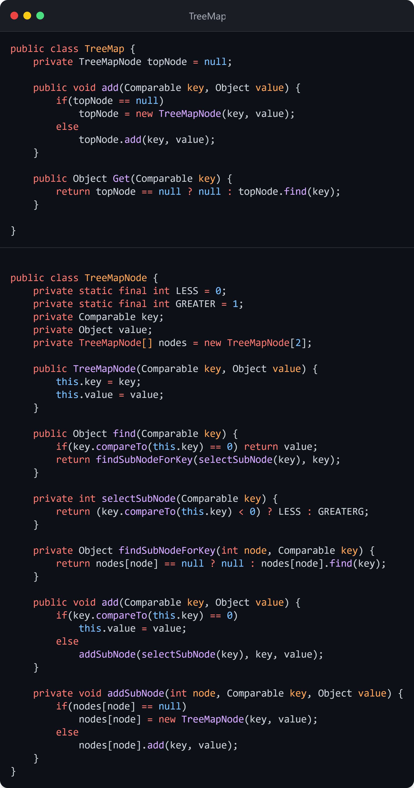

统一建模语言（UML）是一种用于绘制软件概念图的图形符号。

UML有3个级别称为概念级、规格说明级和实现级。规格说明级和实现级的图示与源代码间有很强的关联。

UML包含3种主要的图示。静态图（static diagram）描述了类、对象、数据结构以及它们之间的关系，藉此展现出了软件元素间那些不变的逻辑结构。动态图（dynamic diagram）展示了软件实体在运行过程中是如何变化的，其中描述了运行流程或者实体改变状态的方式。物理图（physical diagram）展示了软件实体不变的物理结构，其中描述了诸如源文件、库、二进制文件、数据文件等物理实体以及它们之间的关系。

模型必须是可测试的。如果不能对模型应用一些可测试的标准，那么构建模型是毫无用处的。如果模型不能被评估，那么这个模型就没有任何价值。

在和他人交流以及帮助解决设计问题方面，图示是最为有用的。重要的一点是，图示的详细程度应该只是达成目标所必需的。你可以绘制具有大量装饰的图示，但那是损害生产力的做法。请保持图示简单、干净。UML图不是源代码，不应该当作声明所有方法、变量和关系的地方。另一方面，在交流算法细节方面，UML并不是非常合适。

在创建大型系统的结构脉络图（road map）方面，UML也很有用。这种脉络图可以使得开发者快速找到类之间的依赖关系，并提供了一份关于整个系统结构的参考。

编写需要保存的设计文档的最好时机是在项目结束时，并把它作为团队的最后一项工作。这种文档会精确地反映出设计的状态，对后继团队来说非常有用。